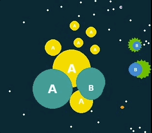

# GoBigger-Explore


[EN](https://github.com/opendilab/Gobigger-Explore/blob/v0.4.0/README.md)

GoBigger-Explore is an open source code collection in the article "GoBigger: A Scalable Platform for Cooperative-Competitive Multi-Agent Interactive Simulation" of ICLR 2023.

<p align="center"></p>

## Outline

* [Release Version](#rocket-release-version)
* [Getting Start](#point_down-getting-start)
* [Result](#dart-result)
* [Resources](#heart_eyes-resources)
* [Join and Contribute](#star-join-and-contribute)
* [License](#cocktail-license)

## :rocket: Release Version
The current version is the latest version 0.4.0.
   
## :point_down: Getting Start

### System environment

- Core 32
- GPU (>=16G)
- Memory 40G

### Install the necessary package
```
git clone git/repo/path
cd bigger_rl
pip install -e .
```

### Start training

1. Serial Training(DQN、PPO、MAPPO、QMix、VMix、COMA)
- Train
    ```
    python -u -m bigrl.bin.serial_train  --config abs/config/path
    ```
- Evaluation
    ```
    python -u -m bigrl.bin.serial_eval  --config abs/config/path
    ```
2. Parallel Training(IMPALA + Alphastar_Loss + League Training)
- Train && Evaluation
    ```
    python -u -m bigrl.single.worker.trainer.trainer  --config abs/config/path
    ```
## Results
- RL Agent vs Bot (Without cooperation)
    <html><video width="512" height="512" controls> <source src="avatar/rlvsbotnoco.mp4" type="video/mp4">Your browser does not support the video tag.</video></html>
- Bot vs Bot
    <html><video width="512" height="512" controls> <source src="avatar/botvsbot.mp4" type="video/mp4">Your browser does not support the video tag.</video></html>
- RL Agent vs Bot (With cooperation)
    <html><video width="512" height="512" controls> <source src="avatar/rlvsbotco.mp4" type="video/mp4">Your browser does not support the video tag.</video></html>
## :heart_eyes: Resources
- GoBigger Repo [Github Link](https://github.com/opendilab/GoBigger)

## :star: Join and Contribute

Welcome to OpenDI Lab GoBigger community! Scan the QR code and add us on Wechat:


Or you can contact us with [slack](https://opendilab.slack.com/join/shared_invite/zt-v9tmv4fp-nUBAQEH1_Kuyu_q4plBssQ#/shared-invite/email) or email (opendilab@pjlab.org.cn).

## :cocktail: License

GoBigger-Explore released under the Apache 2.0 license.