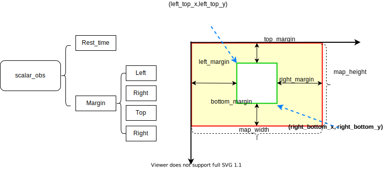
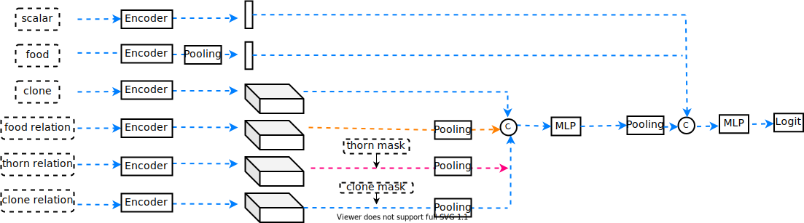
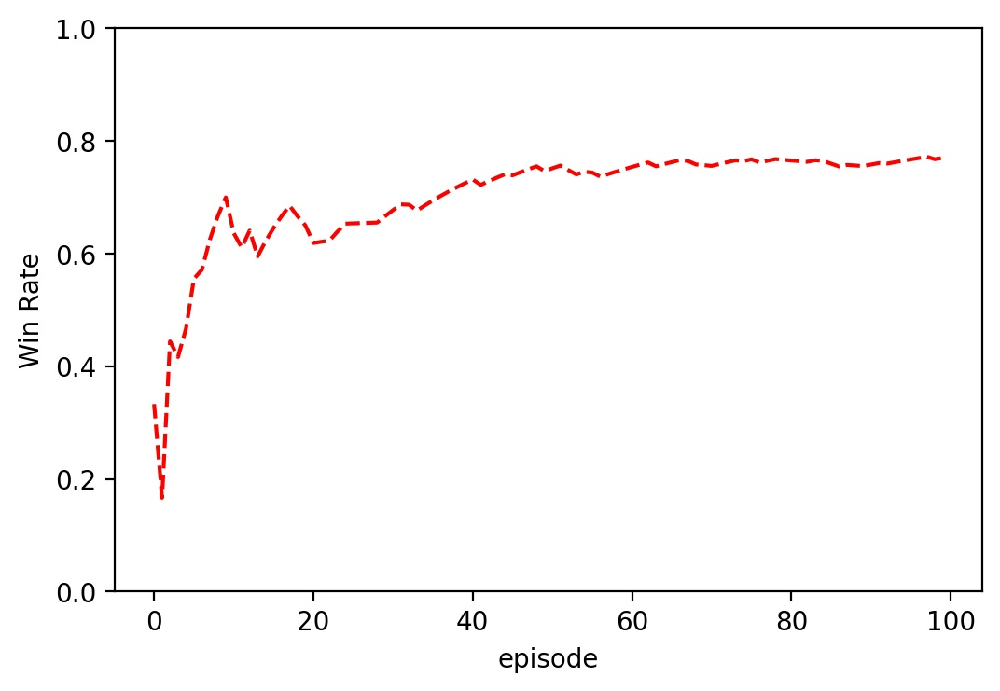
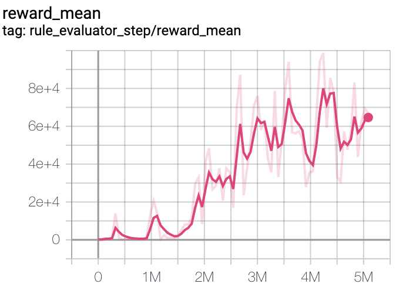
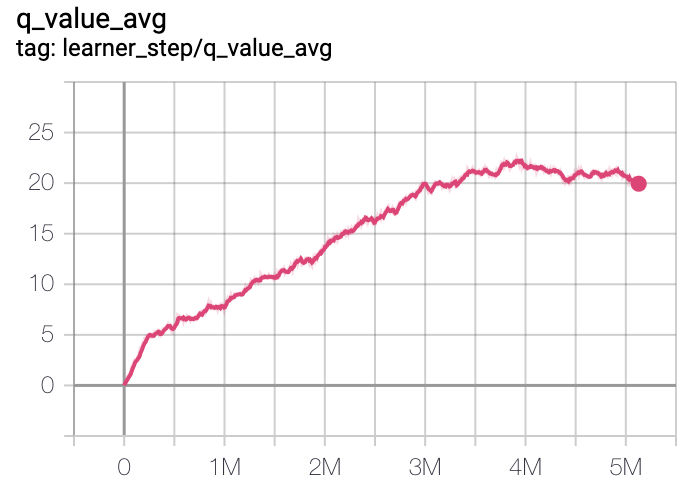

# Gobigger-Explore
## :crystal_ball: GoBigger Challenge 2021 Baseline
[en](https://github.com/opendilab/Gobigger-Explore/blob/main/README.md)/[中文](https://github.com/opendilab/Gobigger-Explore/blob/main/README_zh.md)

## :robot: Introduction
This is the baseline of GoBigger Multi-Agent Decision Intelligence [Challenge](https://www.datafountain.cn/competitions/549) in 2021. The baseline is based on [OpenDILab](https://github.com/opendilab/DI-engine) and aims to provide a simple entry-level method. Participants can build agents by extending the baseline method provided. In addition, Opendilab's modular structure allows participants to easily get started, and it provides a wealth of reinforcement learning algorithms for participants to use. This baseline is a good starting point, especially for entry-level researchers who are familiar with multi-agent decision AI problems.

## :rocket: Release Version
The current version is the latest version 0.3.0.
1. What needs to be optimized in the future
   - Application of advance algorithms.
   - Design and study of advanced actions.
2. Supervised Learning
   - Using bots to [generate data](https://github.com/opendilab/Gobigger-Explore/blob/main/my_submission/sl/generate_data_opensource.py) for supervised learning.
   - The supervised learning model can be used as a competition model or as a pre-train for reinforcement learning.
   - Details can be seen [SL](https://github.com/opendilab/Gobigger-Explore/blob/main/my_submission/sl/)
3. Gobigger with Go-Explore
   - Training Gobigger with Go-Explore algorithm.
   - Speed up network training by loading endgame matches.
   - Details can be seen [go-explore](https://github.com/opendilab/Gobigger-Explore/blob/main/my_submission/go-explore/)
4. Version-0.3.0
   - Adopt in-place algorithm and gradient accumulation strategy to save gpu memory.
   - Efficiently encode the characteristics of the Version-0.2.0 relational section.
   - Simplified network model and efficient training process design.
5. Version-0.2.0
   - [version-0.2.0 version Link](https://github.com/opendilab/Gobigger-Explore/releases/tag/v0.2.0)
   - Fix the ckpt bug to improve the accuracy of the evaluator.
   - Fix replay_buffer bug
   - Replay_buffer stores variable-length features to improve data utilization and training speed.
6. Version-0.1.0
   - [version-0.1.0 version Link](https://github.com/opendilab/GoBigger-Challenge-2021/tree/main/di_baseline)
7. Feature Engineering
   - Brand new feature engineering to improve convergence speed.
      - Scalar Encoder 
        
        - The default upper left corner is the origin of the coordinates.
        - The red rectangle in the figure is the global field of view, and the green rectangle is the local field of view.
   
      - Food Encoder
         - For the convenience of calculation, the area of ball uses the square of the radius, omitting the constant term.
         - The food map divides the local field of vision into h\*w small grids, and the size of each small grid is 16\*16.
         - food map[0,:,:] represents the sum of the area of all food in each small grid。
         - food map[1,:,:] represents the sum of the area of the clone ball of a certain id in each small grid.
         - The food grid divides the local field of vision into h\*w small grids, and the size of each small grid is 8\*8.
         - The food grid represents the offset of the food in each small grid relative to the upper left corner of the grid and the radius of the food.
         - The dimension of the food relation is [len(clone),7\*7+1,3]. Where [:,7\*7,3] represents the food information in the 7\*7 grid neighborhood of each clone ball, including the offset and the sum of the squares of the food area in the grid. Because the coverage rate is very low, an approximation is made here, and the location information of food is subject to the last one. [len(clone):,1,3] represents the offset and area of each clone ball.
      - Clone Encoder
         - Encode the clone ball, including the position, radius, one-hot encoding of the player name, and the speed encoding of the clone ball. 
      - Relation Encoder
         - The relative position relationship between ball_1 and ball_2,(x1-x2,y1-y2).
         - The distance between ball_1 and ball_2.
         - The collision of ball_1 and ball_2 is that the center of a ball appears in another ball.
         - Whether ball_1 and ball_2 collide with each other, that is, the distance between the arc of one ball and the center of the other ball.
         - Whether ball_1 and ball_2 collide with each other after splitting, that is, the distance between the arc of the farthest split ball and the center of the other ball.
         - The relationship between eating and being eaten is the relationship between the radius of the two balls.
         - The relationship between eating and being eaten is the relationship between the radius of the two balls after splitting.
         - The relationship between the radius of the two balls. And ball_1 and ball_2 are mapped to m\*n r1 and m\*n r2 respectively, where m represents the number of ball_1's clone ball, and n represents the number of ball_2's clone ball. 
         
      - Model
          - The role of the mask is to record the effective information after padding. Need to combine code to understand better.
          - The model design in Baseline is not the best, players just enjoy it!
          
8. Win Rate VS Bot
   - Version-0.3.0  VS Rule based bot in [Gobigger](https://github.com/opendilab/GoBigger/blob/main/gobigger/agents/bot_agent.py).
   
9. Version comparison
   - Version-0.3.0 VS Version-0.2.0
     - v0.3.0 is more lightweight, and network design and feature coding are easy to use.
      - v0.3.0reward and Q-value curve
      
      
   
## :point_down: Getting Started

1. System environment
   - Core 8
   - GPU 1080Ti(11G) or 1060(6G)
   - Memory 40G
2. Baseline Config
   
   - The default config is the [config](https://github.com/opendilab/Gobigger-Explore/blob/main/my_submission/config/gobigger_no_spatial_config.py) used in this experiment. Participants can modify it according to the system environment.
   - The size of replay_buffer_size needs to be set according to the size of RAM.
   - The size of batch_size needs to be set according to the size of the GPU memory.
   
3. Install the necessary packege
```
    # Install DI-engine
    git clone https://github.com/opendilab/DI-engine.git
    cd YOUR_PATH/DI-engine/
    pip install -e . --user

    # Install Env Gobigger
    git clone https://github.com/opendilab/GoBigger.git
    cd YOUR_PATH/GoBigger/
    pip install -e . --user
```

4. Start training
```
    # Download baseline
    git clone https://github.com/opendilab/Gobigger-Explore.git
    cd my_submission/entry/
    python gobigger_vsbot_baseline_simple_main.py.py
```

5. Evaluator and Save game videos
```
    cd my_submission/entry/
    python gobigger_vsbot_baseline_simple_eval.py --ckpt YOUR_CKPT_PATH
    # No need to save the video, uncomment line 258 of gobigger_env.py
    python gobigger_vsbot_baseline_simple_quick_eval.py --ckpt YOUR_CKPT_PATH
```

6. SL训练
```
   cd my_submission/sl/
   python generate_data_opensource.py # generate data for training
   python train.py -c ./exp/sample/config.yaml #need change data dir
```

7. Go explore
```
   cd my_submission/go-explore/
   python gobigger_vsbot_explore_main.py
```

## :dart: Result
We released training log information, checkpoints, and evaluation videos. Below is the download link,
   - Version 0.3.0
     - Baidu Netdisk [Link](https://pan.baidu.com/s/11JTsw197jfjfijxpghA06w)
        - Extraction code: 95el
   - Version 0.2.0
     - Baidu Netdisk [Link](https://pan.baidu.com/s/11sBoLWBEN33iNycs8y7fsw)
        - Extraction code: u4i6
   


## :heart_eyes: Resources
   - [Challenge Page Link](https://www.datafountain.cn/competitions/549)
   - Challenge Repo [Github Link](https://github.com/opendilab/GoBigger-Challenge-2021)
   - DI-engine Repo [Github Link](https://github.com/opendilab/DI-engine)
   - GoBigger Repo [Github Link](https://github.com/opendilab/GoBigger)