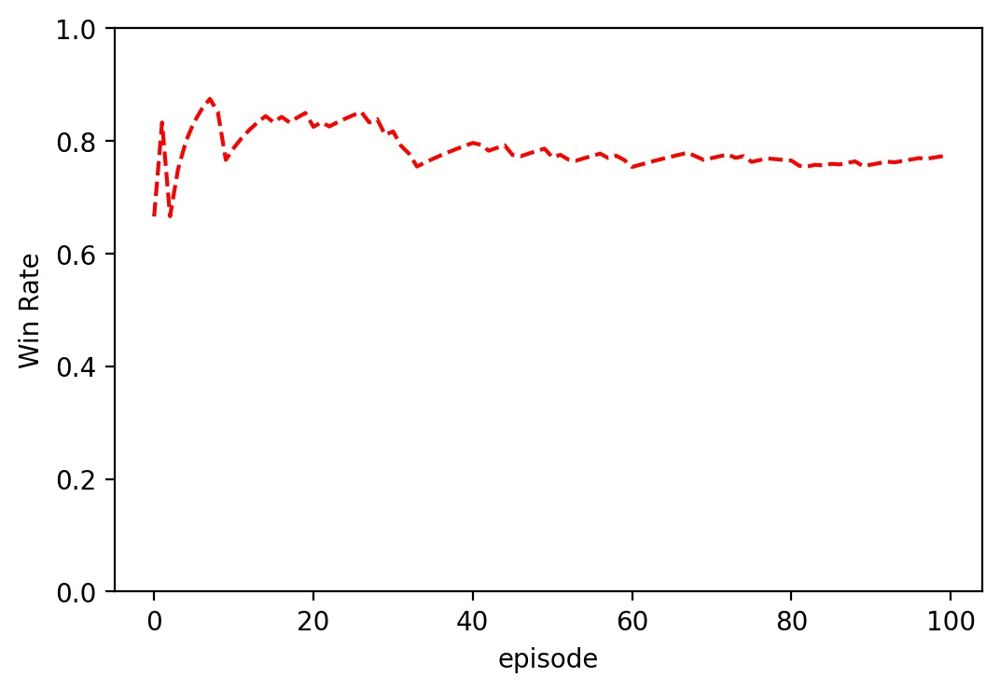
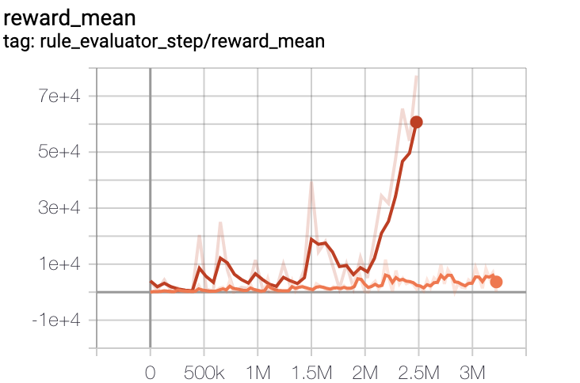
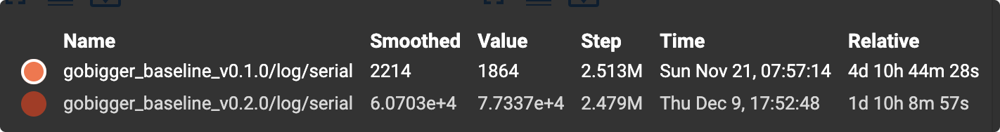

# Gobigger-Explore
## :crystal_ball: GoBigger Challenge 2021 Baseline
[en](https://github.com/opendilab/Gobigger-Explore/blob/main/README.md)/[中文](https://github.com/opendilab/Gobigger-Explore/blob/main/README_zh.md)

## :robot: 介绍
这是2021年GoBigger Multi-Agent Decision Intelligence [Challenge](https://www.datafountain.cn/competitions/549)的基线。基线基于[OpenDILab](https://github.com/opendilab/DI-engine)并旨在提供一种简单的入门级方法。参赛选手可以通过扩展提供的基线方法来构建智能体。此外，OpenDILab的模块化结构让参与者可以轻松读懂代码，并且提供了丰富的强化学习算法供参与者使用。对于熟悉多智能体决策AI问题的入门级研究人员来说，这个基线具有较好的指导意义。

## :rocket: 发布版本
当前版本为最新的版本v-0.2.0。
1. 未来版本预告
   - 不定长的特征存在潜在的显存爆炸风险。
   - 更好的奖励函数设计。
2. Version-0.2.0
   - 修复ckpt bug, 提升evaluator评估器的准确性。
   - 修复replay_buffer bug。
   - 全新的特征工程，提升收敛速度。
   - replay_buffer存放不定长特征，提升数据利用率及训练速度。
3. Version-0.1.0
   - [version-0.1.0版本链接](https://github.com/opendilab/GoBigger-Challenge-2021/tree/main/di_baseline)
4. 与Bot对打的胜率
   - Version-0.2.0 基于规则的Bot位于[Gobigger](https://github.com/opendilab/GoBigger/blob/main/gobigger/agents/bot_agent.py)。
   
5. 版本对比
   - Version-0.2.0 VS Version-0.1.0
      - 由图可知,相同的step数目,Version-0.2.0速度提升了4倍，且收敛性更好。
   
   
## :point_down: 让我们开始吧

1. 实验环境
   - CPU核心数 Core 16
   - GPU显卡 A100(40G)
   - Memory内存 50G
2. 基线参数
   
   - 默认的参数[config](https://github.com/opendilab/Gobigger-Explore/blob/main/my_submission/config/gobigger_no_spatial_config.py)即仓库中开源的参数。参赛选手需根据自己的实验环境配置进行修改。
   - replay_buffer_size的大小需根据系统内存的大小调节。
   - batch_size的大小需要根据显存的大小调节。
   
3. 安装必要的依赖库
```
    # Install DI-engine
    git clone https://github.com/opendilab/DI-engine.git
    cd YOUR_PATH/DI-engine/
    pip install -e . --user

    # Install Env Gobigger
    git clone https://github.com/opendilab/GoBigger.git
    cd YOUR_PATH/GoBigger/
    pip install -e . --user
```

4. 开始训练
```
    # Download baseline
    git clone https://github.com/opendilab/Gobigger-Explore.git
    cd my_submission/entry/
    python gobigger_vsbot_baseline_main.py
```

5. 评估并保存视频
```
    cd my_submission/entry/
    python gobigger_vsbot_baseline_eval.py --ckpt YOUR_CKPT_PATH
```

## :dart: 实验结果
我们开源了训练的log信息，检查点文件以及评估的视频。链接如下，
   - 百度云盘[链接](https://pan.baidu.com/s/11sBoLWBEN33iNycs8y7fsw)
      - 提取码: u4i6
   - 谷歌云盘[链接]()

## :heart_eyes: 相关资源链接
   - [比赛主页链接](https://www.datafountain.cn/competitions/549)
   - Challenge Repo [github链接](https://github.com/opendilab/GoBigger-Challenge-2021)
   - DI-engine Repo [github链接](https://github.com/opendilab/DI-engine)
   - GoBigger Repo  [github链接](https://github.com/opendilab/GoBigger)


